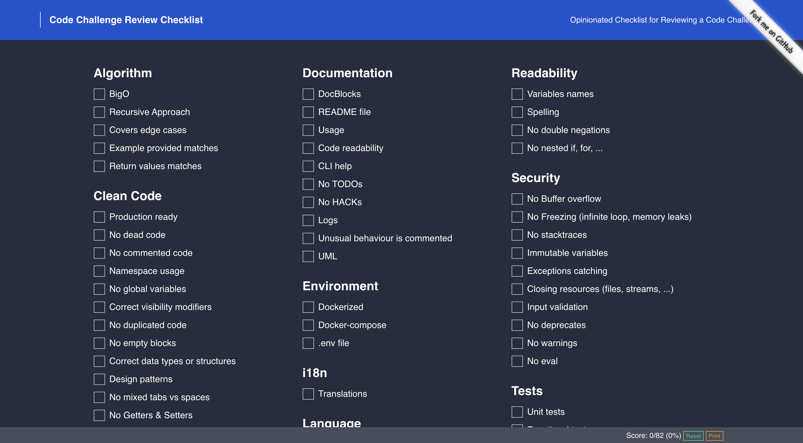

# Code Challenge Review Checklist

An Opinionated Checklist for Reviewing a Code Challenge

## Algorithm

 1. [ ] BigO
 1. [ ] Recursive Approach
 1. [ ] Covers edge cases
 1. [ ] Example provided matches
 1. [ ] Return values matches

## Clean Code

 1. [ ] Production ready
 1. [ ] No dead code
 1. [ ] No commented code
 1. [ ] Namespace usage
 1. [ ] No global variables
 1. [ ] Correct visibility modifiers
 1. [ ] No duplicated code
 1. [ ] No empty blocks
 1. [ ] Correct data types or structures
 1. [ ] Design patterns
 1. [ ] No mixed tabs vs spaces
 1. [ ] No Getters & Setters
 1. [ ] Use Exceptions rather than return codes
 1. [ ] Don't return null
 1. [ ] Make class final if not being used for inheritance
 1. [ ] Dependency Injection
 1. [ ] No Dependency Cycles

## Coding Style

 1. [ ] Code linted
 1. [ ] Respecting community standards
 1. [ ] No issue phpcbf
 1. [ ] No issue php-cs-fixer
 1. [ ] Folder structure
 1. [ ] No debug code

## Complexity

 1. [ ] No complex expressions
 1. [ ] No bitwise operations
 1. [ ] No magic variables
 1. [ ] No magic values
 1. [ ] No magic methods
 1. [ ] Law of Demeter
 1. [ ] No over engineered

## Documentation

 1. [ ] DocBlocks
 1. [ ] README file
 1. [ ] Usage
 1. [ ] Code readability
 1. [ ] CLI help
 1. [ ] No TODOs
 1. [ ] No HACKs
 1. [ ] Logs
 1. [ ] Unusual behaviour is commented
 1. [ ] UML

## Environment

 1. [ ] Dockerized
 1. [ ] Docker-compose
 1. [ ] .env file

## i18n

 1. [ ] Translations

## Language

 1. [ ] Package manager
 1. [ ] Version within EOL
 1. [ ] Using most recent version

## Paradigms

 1. [ ] DRY
 1. [ ] GRASP
 1. [ ] Quick & dirty
 1. [ ] SOLID
 1. [ ] OOP

## Performance

 1. [ ] Speed
 1. [ ] Number of loops

## Presentation

 1. [ ] Color shell

## Readability

 1. [ ] Variables names
 1. [ ] Spelling
 1. [ ] No double negations
 1. [ ] No nested if, for, ...

## Security

 1. [ ] No Buffer overflow
 1. [ ] No Freezing (infinite loop, memory leaks)
 1. [ ] No stacktraces
 1. [ ] Immutable variables
 1. [ ] Exceptions catching
 1. [ ] Closing resources (files, streams, ...)
 1. [ ] Input validation
 1. [ ] No deprecates
 1. [ ] No warnings
 1. [ ] No eval

## Tests

 1. [ ] Unit tests
 1. [ ] Functional tests
 1. [ ] Coverage > 80%
 1. [ ] CI/CD tools

## Versioning

 1. [ ] Git repo
 1. [ ] Many small commits
 1. [ ] Good commit messages
 1. [ ] .gitignore
